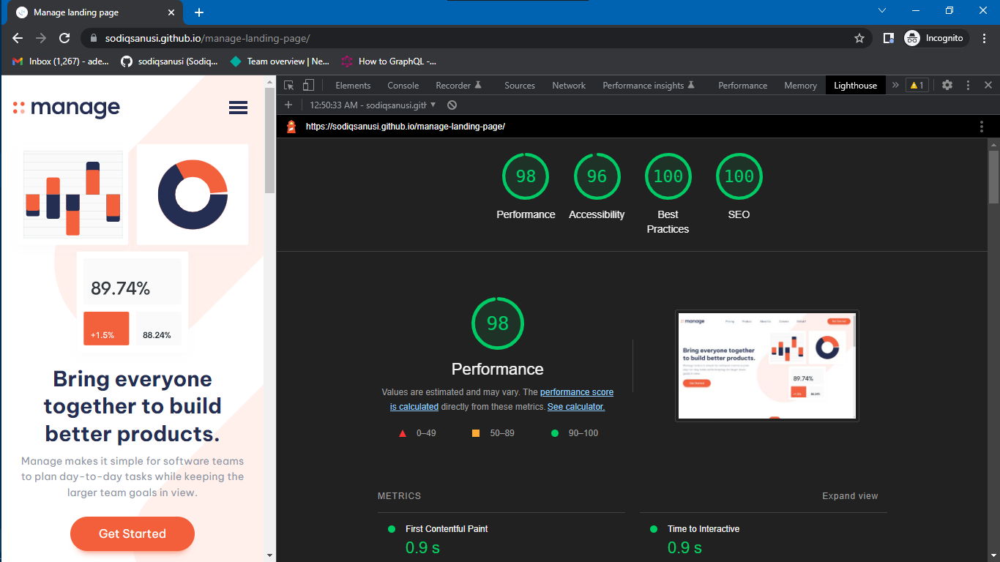

# Manage Landing Page

## Table of contents

- [Overview](#overview)
  - [The challenge](#the-challenge)
  - [Screenshot](#screenshot)
  - [Links](#links)
- [My process](#my-process)
  - [Built with](#built-with)
  - [What I learned](#what-i-learned)
  - [Continued development](#continued-development)
- [Author](#author)
- [Acknowledgments](#acknowledgments)

## Overview
The goal was to create the landing page of a software company that provides a tech solution for businesses. It was a static site, so there was emphasis on getting the final site as close as possible to the base designs, regardless of the user's device size.

### The challenge
Users should be able to:

- View the optimal layout for the site depending on their device's screen size
- See hover states for all interactive elements on the page
- See all testimonials in a horizontal slider
- Receive an error message when the newsletter sign up form is submitted if:
  - The input field is empty
  - The email address is not formatted correctly

### Screenshot

### Links
- Solution URL: [https://github.com/sodiqsanusi/manage-landing-page/](https://github.com/sodiqsanusi/manage-landing-page/)
- Live Site URL: [https://sodiqsanusi.github.io/manage-landing-page/](https://sodiqsanusi.github.io/manage-landing-page/)

## My process
Okayy, this one was mid to be honest. Same old process. If you don't know the old process, you can check [an older project I've built](https://github.com/sodiqsanusi/bookmark-landing-page#my-process), it's documented there. Decided to build the horizontal slider for the testimonial cards last though.

### Built with
- Mobile-first workflow
- Plain HTML/CSS

### What I learned
Nothing much here really, but it was nice building this up nonetheless.

### Continued development
Planning on collaborating to build a site with someone, so that's something I'm looking forward to in a way. Also getting portfolio inspirations, the urge to build a portfolio and an online presence is getting stronger.

## Author
- Twitter - [@sodiqsanusi0](https://www.twitter.com/sodiqsanusi0)
- LinkedIn - [Sodiq Sanusi](https://www.linkedin.com/in/sodiqsanusi0)

## Acknowledgments
To Ridwan. For being the extra push I need most times, and for being a friend. A good friend.
